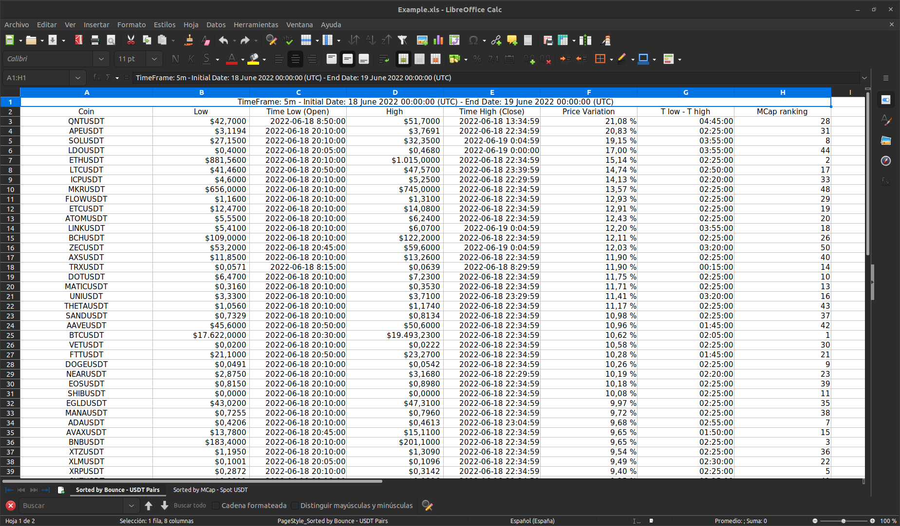

# binance-pair-filtering

A very simple script, made to solve a simply but boring (to verify) question: How to get a list of coins with only BTC pairs?

Why this would matter?

> Once upon a time, Binance had savage pumps when they announced a stable pair (BUSD in particular) for a coin without stables (100% of time only with BTC/ETH pair).

Based upon observation that most (all) tokens without stables pairs have a BTC one, I made this simple script which runs as follows (for the case of BTC  AND no stable pairs, the script ask you what pairs you want to filter):

1. Retrieve ALL BTC pairs.
2. Retrieve ALL USDT pairs.
3. Retrieve ALL BUSD pairs.
4. Filter: From 1. eliminate pairs which are in 2.: Call this 1'; from 3. eliminate pairs which are in 2.: Call this 2'. 
5. Finally, Eliminate from 1' pairs contained in 2'.
6. As an extra step, filter pairs which are no longer traded in Binance.

Example:

